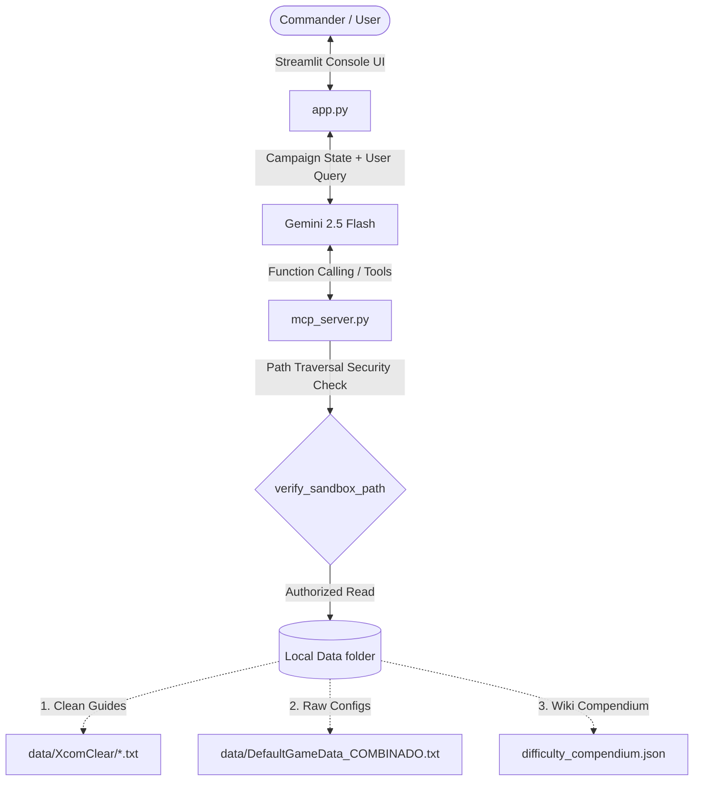

# 🎯 XCOM 2 Tactical Wingman

A local intelligent assistant (AI Agent) and strategic console designed to help XCOM 2 commanders make optimal base-building decisions, combat tactical choices, and soldier builds based on official guides and real game files. 

Built as a submission for the **AI Agents: Intensive Vibe Coding Capstone Project** (Kaggle & Google).

---

## 👽 Overview & Problem Statement
XCOM 2 is a complex, high-stakes tactical game where a single miscalculation can lead to permanent character death ("permadeath") or campaign failure.
- **The Problem:** Game mechanics (like hidden "Aim Assist" multipliers, encounter tables, and facility construction costs) are buried inside massive, cryptic game configuration files (e.g., `DefaultGameData.ini` with 14,000+ lines) or spread across long-form wiki pages. Players are forced to alt-tab, search through forums, or make blind guesses.
- **The Solution:** *XCOM 2 Tactical Wingman* introduces a localized AI Agent acting as **Central Officer Bradford**. Bradford is context-aware of the current campaign state and uses a **Model Context Protocol (MCP) server** to query real-time configuration parameters, difficulty compendiums, and strategy guides.

---

## 🛠️ Architecture



---

## 🏆 Hackathon Key Concepts Applied

This project demonstrates three of the core concepts covered in the Kaggle/Google Intensive Vibe Coding course:

1. **Agent / System (ADK & Gemini API):** 
   - Uses the `google-genai` SDK to run `gemini-2.5-flash` in a chat session.
   - Dynamically injects the current **Campaign State** (difficulty, month, Avatar project progress, weapon/armor tiers, resources, active research) into the prompt header.
   - Configures the agent with custom system instructions, shaping its persona into the determined, military tone of *Central Officer Bradford* and directing it to output a structured **Tactical Recommendation Report** with success probabilities for campaign choices.

2. **Model Context Protocol (MCP) Server:**
   - Implements a self-contained python FastMCP server in [mcp_server.py](file:///C:/Users/carlo/Documents/XCOMGUIDE/tactical_wingman/mcp_server.py).
   - Exposes three custom tools to the Gemini agent:
     - `search_strategy_guide`: Scans paragraph chunks of tactical wikis using custom tf-idf-like relevance scoring.
     - `search_game_config`: Runs filters over the 14,000+ line INI game config file.
     - `get_difficulty_mechanics`: Pulls hidden stats (e.g. aim assist bonuses, spawn timelines) from a local JSON compendium.

3. **Security Features (Sandbox Validation):**
   - Implement path traversal verification in [mcp_server.py](file:///C:/Users/carlo/Documents/XCOMGUIDE/tactical_wingman/mcp_server.py#L26-30) using the `verify_sandbox_path` function.
   - Ensures that tools cannot be forced via prompt injection to read files outside the project's directory (`C:\Users\carlo\Documents\XCOMGUIDE\tactical_wingman\data`).

---

## 📂 Project Structure

- [app.py](file:///C:/Users/carlo/Documents/XCOMGUIDE/tactical_wingman/app.py): Streamlit dashboard and chat interface with Gemini 2.5 Flash.
- [mcp_server.py](file:///C:/Users/carlo/Documents/XCOMGUIDE/tactical_wingman/mcp_server.py): FastMCP server declaring read-only lookup tools.
- [difficulty_compendium.json](file:///C:/Users/carlo/Documents/XCOMGUIDE/tactical_wingman/difficulty_compendium.json): JSON database with aim assist factors and calendar tables.
- `data/`: Self-contained database of raw configs and strategy guides.
- [test_tools.py](file:///C:/Users/carlo/Documents/XCOMGUIDE/tactical_wingman/test_tools.py): Unit test script to verify database queries.
- [requirements.txt](file:///C:/Users/carlo/Documents/XCOMGUIDE/tactical_wingman/requirements.txt): Python dependencies.

---

## 🚀 Requirements and Setup

### 1. Configure Gemini API Key
Obtain an API key from [Google AI Studio](https://aistudio.google.com/) and export it:
```bash
# Windows (PowerShell)
$env:GEMINI_API_KEY="your_api_key_here"

# Windows (CMD)
set GEMINI_API_KEY="your_api_key_here"
```
*Alternatively, you can paste the API Key directly in the UI sidebar.*

### 2. Install Dependencies
Create a virtual environment and install requirements:
```bash
# Create environment
python -m venv .venv

# Activate environment
.venv\Scripts\activate

# Install dependencies
pip install -r requirements.txt
```

### 3. Run Verification Tests
Verify that the search tools read local files correctly:
```bash
python test_tools.py
```

### 4. Launch the Console
Start the Streamlit web console:
```bash
streamlit run app.py
```
This opens `http://localhost:8501` in your browser.

---

## 🛡️ License
This project is licensed under the MIT License.
