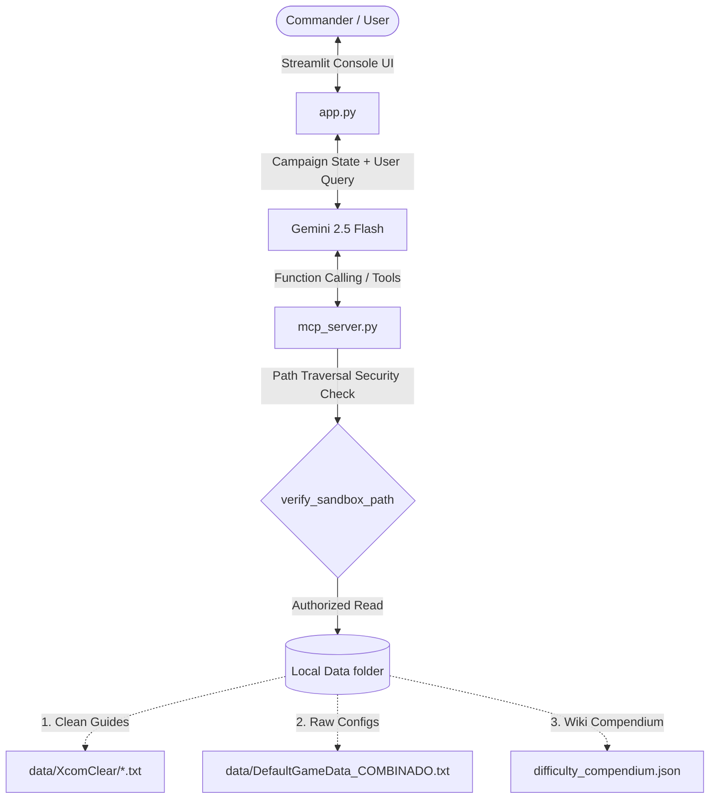

# 🛸 Kaggle Writeup: XCOM 2 Tactical Wingman

## **Project Title:** XCOM 2 Tactical Wingman
### **Subtitle:** A Localized Context-Aware AI Agent using Model Context Protocol (MCP) and Sandbox Validation to Assist Commanders in High-Stakes Strategy Gaming
### **Track Selection:** Freestyle

---

## 👽 1. Executive Summary & Problem Statement

### The Problem
*XCOM 2* is a critically acclaimed turn-based tactical strategy game. However, its high difficulty threshold and permanent character death ("permadeath") mechanics make it notoriously unforgiving. To make optimal decisions, players must know hidden game details, such as:
* **Hidden Aim Assist:** The game secretly boosts or penalizes hit probabilities depending on the difficulty setting and previous misses.
* **Progressive Calendar Timelines:** The monthly appearance rate of new alien enemies (e.g., Mutons, Sectopods) dictates when players must upgrade weapons or armors.
* **Massive Configuration Files:** Core game balancing data is buried inside massive configuration files (like `DefaultGameData.ini` which spans over 14,000 lines).
* **Community Wisdom:** Optimal base-building layouts, tech research queues, and soldier class builds are scattered across long-form wikis and Steam community guides.

Traditionally, players are forced to alt-tab out of the game, search web forums, or crawl raw files, which breaks military immersion and disrupts gameplay flow.

### The Solution: XCOM 2 Tactical Wingman
The *XCOM 2 Tactical Wingman* is a localized, context-aware AI agent acting as **Central Officer Bradford** (the commander's right-hand advisor). The agent acts as an in-game console where players input their current campaign state (month, difficulty, resources, active research) and chat directly with their advisor. 

Bradford uses **Model Context Protocol (MCP)** to search actual game configuration files, query official difficulty tables, and retrieve paragraphs from strategy guides in real-time. This translates raw database files into actionable military intelligence.

---

## 🏗️ 2. System Architecture & The Build

The application is built using a decoupled client-server architecture designed to run efficiently on local machines or cloud hosting providers.



### Technology Stack
* **UI Interface:** [Streamlit](file:///C:/Users/carlo/Documents/XCOMGUIDE/tactical_wingman/app.py) designed with a retro-futuristic dark mode theme, mimicking the XCOM command center's holographic displays.
* **AI Core:** Google Gemini 2.5 Flash accessed via the official `google-genai` SDK.
* **Tool Orchestration:** A python FastMCP server in [mcp_server.py](file:///C:/Users/carlo/Documents/XCOMGUIDE/tactical_wingman/mcp_server.py) defining lookups.
* **Local Data Stores:** Raw game configurations, JSON databases of aim assist bonuses, and raw strategy guide texts compiled in a local `data/` directory.

---

## 🏆 3. Hackathon Key Concepts Applied

This project demonstrates the application of five key course concepts:

| Course Concept | Implementation & File References |
| :--- | :--- |
| **1. Agent System (ADK)** | Context-aware chat session using `google-genai` in [app.py](file:///C:/Users/carlo/Documents/XCOMGUIDE/tactical_wingman/app.py). |
| **2. MCP Server** | FastMCP server declaring read-only search tools in [mcp_server.py](file:///C:/Users/carlo/Documents/XCOMGUIDE/tactical_wingman/mcp_server.py). |
| **3. Antigravity** | Development, testing, encoding fixes, and security sandboxing assisted by Antigravity CLI. |
| **4. Security Features** | Path traversal verification in [mcp_server.py](file:///C:/Users/carlo/Documents/XCOMGUIDE/tactical_wingman/mcp_server.py#L26-L30). |
| **5. Deployability** | Standard UTF-8 files, in-process fallback import, and pinned environment setup in [requirements.txt](file:///C:/Users/carlo/Documents/XCOMGUIDE/tactical_wingman/requirements.txt). |

### Concept 1: Agent System (ADK & Gemini API)
The agent runs in a chat session using `google-genai`. To make the agent context-aware, Streamlit collects the sidebar configuration parameters and formats them into a campaign state header block. This header is prepended to the user's prompt on every turn. 

```python
state_str = (
    f"[XCOM CAMPAIGN STATE STATUS:\n"
    f"- Active Difficulty: {local_context['Dificultad']}\n"
    f"- Current Month: {local_context['Mes']}\n"
    f"- Resources: Supplies={local_context['Suministros']}, Intel={local_context['Intel']}, "
    f"Engineers={local_context['Ingenieros']}, Scientists={local_context['Cientificos']}\n"
    f"- Current Research: {local_context['Investigacion_Actual']}]\n\n"
    f"Commander's query: {user_query}"
)
```

The model is configured with a strict system persona (**Central Officer Bradford**), instructing it to output tactical briefings with estimated success percentages and to summarize the campaign state in a markdown table at the start of each response.

### Concept 2: Model Context Protocol (MCP) Server
Instead of overwhelming the LLM's context window with large text files, [mcp_server.py](file:///C:/Users/carlo/Documents/XCOMGUIDE/tactical_wingman/mcp_server.py) implements three read-only tools:
1. `search_strategy_guide(query)`: Scans guide paragraph blocks using tokenized frequency matching to retrieve the top 5 relevant advice fragments.
2. `search_game_config(query, difficulty)`: Filters matching lines in the 14,000+ line config file, restricting results to the active section (e.g. `[XComGame.XComGameState_CampaignStart]`).
3. `get_difficulty_mechanics(difficulty_name)`: Reads [difficulty_compendium.json](file:///C:/Users/carlo/Documents/XCOMGUIDE/tactical_wingman/difficulty_compendium.json) to retrieve hidden mechanics like Aim Assist values.

### Concept 3: Antigravity Co-Pilot
The project was built in close collaboration with the Antigravity pair programmer. Antigravity was used to write and refactor key functions, run integration scripts (e.g., [test_tools.py](file:///C:/Users/carlo/Documents/XCOMGUIDE/tactical_wingman/test_tools.py)), diagnose encoding errors (such as converting `requirements.txt` from UTF-16LE to standard UTF-8), and audit the security architecture.

### Concept 4: Security Features (Sandbox Path Verification)
To prevent prompt injection attacks (where a user might instruct the agent to read system files like `/etc/passwd` or `C:/Windows/win.ini` through the tool arguments), the MCP server enforces strict path verification. The [verify_sandbox_path](file:///C:/Users/carlo/Documents/XCOMGUIDE/tactical_wingman/mcp_server.py#L26-L30) function checks that any resolved file path starts with the project's root folder:

```python
def verify_sandbox_path(path: str, base_directory: str = PROJECT_DIR) -> bool:
    real_base = os.path.realpath(base_directory)
    real_target = os.path.realpath(path)
    return real_target.startswith(real_base)
```

If a tool attempts to read a file outside of the sandbox directory, the request is immediately rejected.

### Concept 5: Deployability (Hugging Face Spaces)
The repository is structured for production environments. To allow standard deployment:
* **In-process fallback:** The Streamlit dashboard imports the MCP tools directly from `mcp_server.py` as standard python functions. This removes the need to orchestrate separate background processes on basic cloud servers.
* **Deterministic environment:** All packages (like `streamlit==1.58.0`, `google-genai==2.10.0`, and `mcp==1.28.0`) are pinned in [requirements.txt](file:///C:/Users/carlo/Documents/XCOMGUIDE/tactical_wingman/requirements.txt) to guarantee matching build environments.

---

## ⚙️ 5. Advanced UX Improvements

1. **Context Overriding System (Chat > Menus Hierarchy Rule):**
   If a user types *"I currently have 150 supplies and 0 alloys"* in the chat, the backend regex parser interceptor [override_context_from_query](file:///C:/Users/carlo/Documents/XCOMGUIDE/tactical_wingman/app.py#L12) automatically overrides the sidebar values. This resolves menu-to-chat value contradictions, prioritizing the user's immediate chat description.
2. **Dynamic Greeting & Tactical Actions:**
   Commanders can use `🧹 Clear Chat` to reset histories or `💾 Save Report` to download a fully formatted Markdown dossier (`xcom2_tactical_report.md`) detailing campaign stats and Bradford's tactical recommendations.
3. **Infinite Search Prevention (Config Contents Tip):**
   System instructions warn the LLM that specific research point costs are not stored in `DefaultGameData.ini` (they belong to `DefaultGameCore.ini`), eliminating infinite tool query loops when information is missing.

---

## 🔗 5. Project Assets

* **Public Code Repository:** [GitHub - MrWhilhelmSan/Xcom2Wingman](https://github.com/MrWhilhelmSan/Xcom2Wingman)
* **Working Interactive Demo:** [Hugging Face Space - XCOM 2 Tactical Wingman](https://huggingface.co/spaces/CharlieBonito/xcomwingman)
* **Video Submission (YouTube):** *[Insert YouTube Link Here]* (5 minutes or less, covering problem, agent architecture, demo, and deployment).
